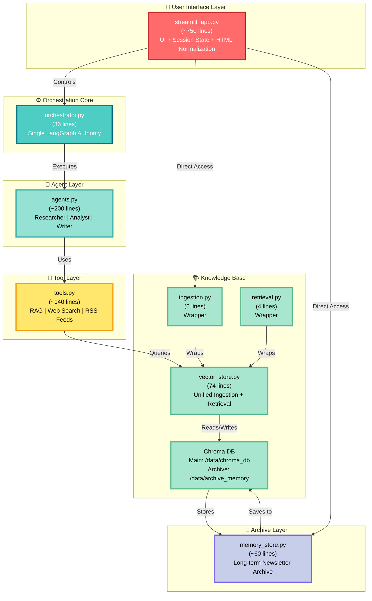
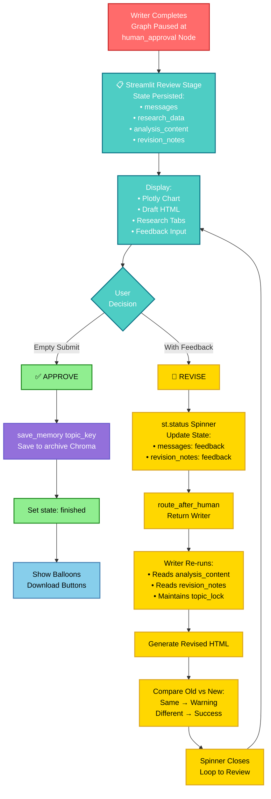
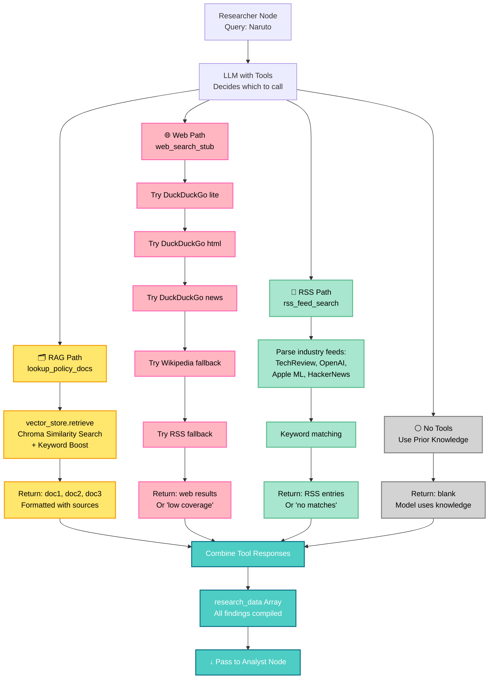
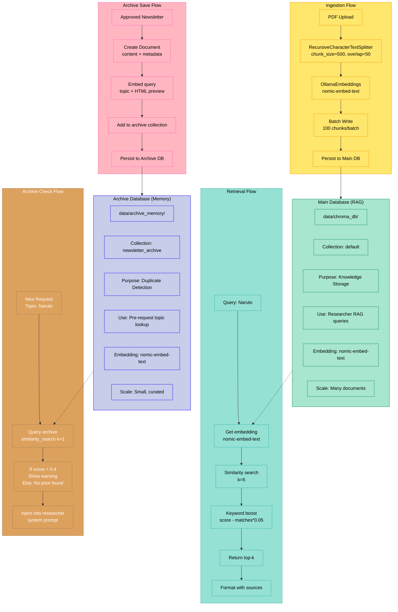

# NewsNexus Architecture - Mermaid Diagram

## Complete System Architecture



## Data Flow: User Request → Newsletter

```mermaid
graph LR
    A["👤 User Input<br/>Topic: Naruto"] --> B["normalize_topic()<br/>Check Memory"]
    B --> C["Init Orchestrator<br/>Create StateGraph"]
    C --> D["🔍 Researcher Node<br/>Execute Tools"]
    
    D --> E{Which Tools?}
    E -->|RAG| F["lookup_policy_docs<br/>Vector Search<br/>+ Keyword Boost"]
    E -->|Web| G["web_search_stub<br/>DuckDuckGo<br/>+ Fallbacks<br/>+ Wikipedia"]
    E -->|RSS| H["rss_feed_search<br/>Industry Feeds<br/>TechReview, OpenAI, etc"]
    E -->|None| I["Use Prior Knowledge"]
    
    F --> J["📊 Analyst Node<br/>6-Section Analysis"]
    G --> J
    H --> J
    I --> J
    
    J --> K["Extract Chart Data<br/>JSON from response"]
    K --> L["✍️ Writer Node<br/>Premium HTML"]
    L --> M["normalize_generated_html()<br/>Strip preface/fences"]
    M --> N["sanitize_html()<br/>Bleach + CSS Preserve"]
    N --> O["👁️ Human Review<br/>HITL Approval"]
    
    O -->|Has Feedback| P["📝 Revise via Writer<br/>Keep Topic Lock"]
    P --> Q["Compare Drafts<br/>Show Changes"]
    Q --> O
    
    O -->|Approved| R["💾 Archive to Memory<br/>Save Newsletter"]
    R --> S["✅ Finished State<br/>Download HTML/PDF"]
    
    classDef input fill:#FF6B6B,stroke:#C92A2A,color:#fff
    classDef process fill:#4ECDC4,stroke:#0B7285,color:#fff
    classDef research fill:#FFE66D,stroke:#F59E0B,color:#000
    classDef analysis fill:#A8E6CF,stroke:#5DBA8F,color:#000
    classDef html fill:#FFB6C1,stroke:#FF69B4,color:#000
    classDef hitl fill:#DDA15E,stroke:#A67C52,color:#fff
    classDef finish fill:#90EE90,stroke:#228B22,color:#000
    
    class A input
    class B,C process
    class D,E,F,G,H,I,J,K research
    class L,M,N html
    class O,P,Q hitl
    class R,S finish
```



## Feedback Cycle Detail



## Tool Invocation Paths



## HTML Newsletter Generation Pipeline

```mermaid
graph LR
    A["Analyst Complete<br/>6-Section Analysis"] --> B["Writer Node Receives:<br/>• analysis_content<br/>• primary_topic<br/>• revision_feedback"]
    
    B --> C["LLM Contract:<br/>PRIMARY TOPIC LOCK<br/>Strict HTML Skeleton<br/>Inline CSS Only"]
    
    C --> D["Model Output<br/>Raw with preface:<br/>Here is...\n\n```html\n...\n```"]
    
    D --> E["normalize_generated_html<br/>1. Strip prose<br/>2. Remove fences<br/>3. Extract clean HTML"]
    
    E --> F["Clean HTML<br/>!DOCTYPE html\n..."]
    
    F --> G["sanitize_html<br/>1. Bleach tags<br/>2. Bleach styles<br/>3. Preserve inline CSS<br/>4. Remove script/iframe"]
    
    G --> H["Safe HTML<br/>Ready to render"]
    
    H --> I["Display in Streamlit<br/>st.components.v1.html"]
    I --> J["Download Buttons<br/>HTML | PDF"]
    
    classDef input fill:#FFE66D,stroke:#F59E0B,color:#000
    classDef prompt fill:#4ECDC4,stroke:#0B7285,color:#fff
    classDef model fill:#95E1D3,stroke:#38B2AC,color:#000
    classDef norm fill:#FFB6C1,stroke:#FF69B4,color:#000
    classDef clean fill:#A8E6CF,stroke:#5DBA8F,color:#000
    classDef safe fill:#90EE90,stroke:#228B22,color:#000
    classDef render fill:#87CEEB,stroke:#4682B4,color:#000
    
    class A,B input
    class C prompt
    class D model
    class E,F norm
    class G,H clean
    class I,J render
```



## Chroma Vector Store Organization



## Session State Flow

```mermaid
stateDiagram-v2
    [*] --> idle
    
    idle --> idle: PDF Upload<br/>Build Index<br/>Check Memory
    
    idle --> researching: [Click Start Agents]<br/>Initialize orchestrator
    
    researching --> researching: Stream graph events<br/>Show research_data<br/>Show chart_data<br/>Update draft preview
    
    researching --> reviewing: Graph completes<br/>Pause at human_approval
    
    reviewing --> reviewing: Show HTML draft<br/>Show chart<br/>Show research tabs<br/>User can read
    
    reviewing --> researching: [Submit Feedback]<br/>Update revision_notes<br/>Resume Writer node<br/>Show spinner
    
    reviewing --> finished: [Approve]<br/>save_memory()<br/>archive to Chroma
    
    finished --> finished: Show balloons<br/>Display final preview<br/>Download buttons
    
    finished --> idle: [New Research]<br/>Reset session state
    
    note right of idle\n      Waiting for user input\n      Can upload PDFs\n    end note
    
    note right of researching\n      LangGraph executing\n      Researcher → Analyst → Writer\n    end note
    
    note right of reviewing\n      PAUSE POINT\n      Human intervention\n      Can revise or approve\n    end note
    
    note right of finished\n      Newsletter ready\n      Can download\n      Can start new\n    end note
```

---

## Key Files Reference

| File | Purpose | Lines | Key Responsibility |
|------|---------|-------|-------------------|
| **streamlit_app.py** | UI + Session | ~750 | User interaction, HTML normalization, session state management |
| **orchestrator.py** | Graph Authority | 36 | Single LangGraph center, node routing, conditional logic |
| **agents.py** | Agent Nodes | ~200 | Researcher/Analyst/Writer behaviors, prompts, state mutations |
| **tools.py** | Tool Layer | ~140 | RAG/web/RSS tools, fallbacks, LLM tool binding |
| **vector_store.py** | Vector Access | 74 | Unified ingestion + retrieval, embedding, Chroma connection |
| **ingestion.py** | Wrapper | 6 | Backward compatibility for PDF → vector workflow |
| **retrieval.py** | Wrapper | 4 | Backward compatibility for vector → search workflow |
| **memory_store.py** | Archive | ~60 | Newsletter persistence, duplicate detection, memory search |

---

## Design Principles

✅ **Single Orchestrator** - One source of truth for workflow  
✅ **Unified Vector Store** - Centralized embedding + retrieval  
✅ **Node-Only Agents** - Clean separation of concerns  
✅ **Resilient Fallbacks** - Web search tries 5 paths before failure  
✅ **State-Driven** - No position inference, explicit state mutations  
✅ **Inline CSS Only** - Survives Bleach sanitizer  
✅ **Two Chroma DBs** - Main (RAG) + Archive (memory) separate purposes  
✅ **Visible Feedback** - User sees all revisions and changes  

---

**All 8 files working together to deliver a complete GenAI news research → analysis → newsletter pipeline with human-in-the-loop approval and long-term memory.**
